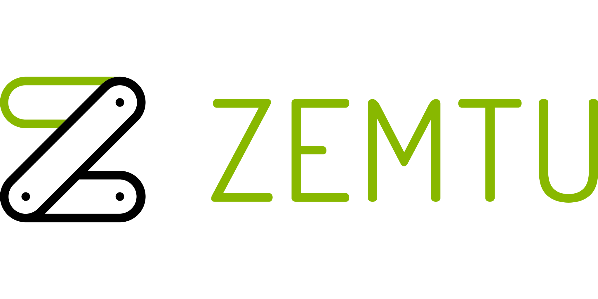

# What is dj-stripe?

Dj-stripe is an extensible wrapper around the Stripe API that continuously syncs most of the Stripe Data to your local database as pre-implemented Django Models, out of the box! This allows you to use the Django ORM, in your code, to work with the data making it easier and faster!

For example, if you need to interact with a customer subscription, you can use **dj-stripe’s Subscription Model**, in your code, to get the subscription data for that customer as well as the related models’ data too (if need be and **potentially in 1 database query!**) instead of making multiple slower and unreliable consecutive network calls only to parse through 1 or more of Stripe’s JSON like objects!

# Features

* **Simplified Security**: We make it simple for you to collect sensitive data such as credit card numbers and remain PCI compliant. This means the sensitive data is sent directly to Stripe instead of passing through your server. For more information, see our Integration Security Guide.

* **Wallets**: We support all Stripe supported wallets including but not limited to Apple Pay and Google Pay.

* **Payment methods**: Accepting more payment methods helps your business expand its global reach and improve checkout conversion.

* **SCA-Ready**: The SDK automatically performs native 3D Secure authentication if needed to comply with Strong Customer Authentication regulation in Europe and other countries as mandated by the law.

* Support for multiple accounts and API keys → **May be done by the time this website is ready**

* Tested with Stripe API 2020-08-27 (see API versions)

* We support the following Stripe functionalities:

**Stripe Core**

**Payment Methods**

**Product**

**Checkout**

**Billing**

**Connect**

**Sigma**

# Tutorials

The dj-stripe community has come up with some great tutorials:

## Videos

--

## Blogs

* [How to Create a Subscription SaaS Application with Django and Stripe - Sep 2021 - Django 3.2 - dj-stripe 2.4.3](https://www.saaspegasus.com/guides/django-stripe-integrate/)
* [Using Django and Stripe for Monthly Subscriptions - May 4, 2021 Uses Stripe Elements](https://ordinarycoders.com/blog/article/django-stripe-monthly-subscription)
* [Django Stripe Integration with using dj-stripe - Jun 12, 2020](https://kartaca.com/en/django-stripe-integration-using-dj-stripe/)

**Have a blog, video or online publication? Write about your dj-stripe tips and tricks, then send us a pull request with the link.**

# Who uses dj-stripe?

